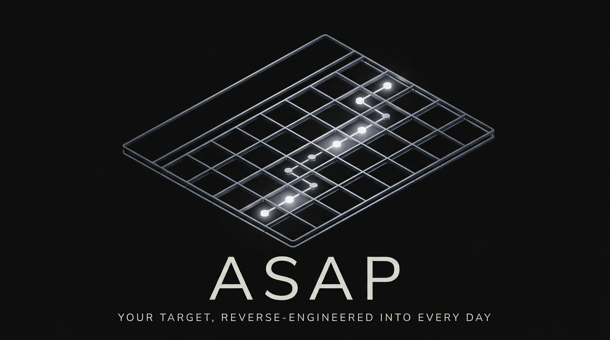

# ASAP Showcase

<p align="center">
  
</p>

**Open sourced October 6, 2026.**

An interactive real estate workflow showcase with fictional sample data.

Live reference: https://asap-showcase.vercel.app

## Run locally

Use Node.js 22.12 or later (Node.js 24 recommended).

```sh
npm ci
npm run dev
```

## Production build

```sh
npm run build
npm run preview
```

The demo account is **Guest User**. The showcase uses a local demo store; no environment file, API keys, Supabase project, or backend is required. Sample workspace edits persist in browser storage. Use the reset button to restore the fictional workspace.

## Demo boundaries

This is a frontend demonstration. Accounts, live CRM integrations, external messaging, and production automation are not connected. The UI and sample data are preserved from the ASAP showcase.

The package manifest and lockfile are retained from the source app. Backend functions, private deployment metadata, verification scripts, and test sources are omitted from this standalone copy. The original manifest's test and check:deno scripts are retained but are not supported in this showcase-only repository.

No license is granted beyond applicable default copyright rights unless the owner adds a license.
